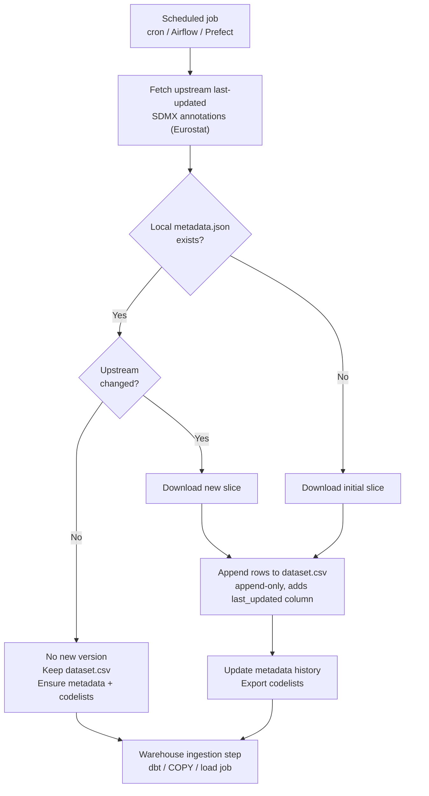

# Overview

`sdmxflow` is a Python **SDMX ingestion** library that produces deterministic, append-only artifacts for **data warehouse ETL/ELT** workflows: a facts CSV, a metadata history trail, and exported codelists.

It is built for data engineers and analytics engineers who need scheduled refresh semantics, reproducible artifacts, and reference data exports — not ad-hoc interactive SDMX exploration.

> **Status**
> Early but functional. The **artifact contract is stable** and designed to remain consistent as additional providers are added.
>
> **Provider support (today):** Eurostat (`source_id="ESTAT"`). See [Provider Support](provider-support.md) for details and differences.

## What you get (artifact contract)

Given an `out_dir`, `sdmxflow` writes:

- `dataset.csv` — append-only facts across upstream versions, tagged by a leading `last_updated` column
- `metadata.json` — operational metadata + an append-only version history
- `codelists/` — reference CSVs (`code,name`) used to interpret coded dataset columns

Example output tree:

```text
<out_dir>/
    dataset.csv
    metadata.json
    codelists/
        <CODELIST_ID>.csv
    logs/                # only when save_logs=True
        <agency>__<dataset>__<timestamp>.log
```

## Quickstart (minimal)

```python
from pathlib import Path

from sdmxflow import SdmxDataset

ds = SdmxDataset(
    out_dir=Path("./out/lfsa_egai2d"),
    source_id="ESTAT",
    dataset_id="lfsa_egai2d",
    save_logs=True,  # writes <out_dir>/logs/<agency>__<dataset>__<timestamp>.log
)

result = ds.fetch()
print("appended:", result.appended)
```

## How refresh works (workflow)

This diagram is intentionally identical to the README and describes the production workflow `fetch()` implements.



## Docs map (where to go next)

- New here? Start with [Getting Started](getting-started.md).
- Need file semantics? Read [Output Artifacts (Contract)](output-layout.md).
- Deploying on a schedule? See [Scheduling & Deployment](scheduling-and-deployment.md).
- Loading into a warehouse? See [Integration Patterns](integration-patterns.md).
- Looking for parameters and defaults? See [Configuration Reference](api.md).
- Provider behavior and roadmap: [Provider Support](provider-support.md).
- Operational issues: [FAQ & Troubleshooting](faq.md).
- Release history: [Changelog](changelog.md) (or https://github.com/knifflig/sdmxflow/releases)
